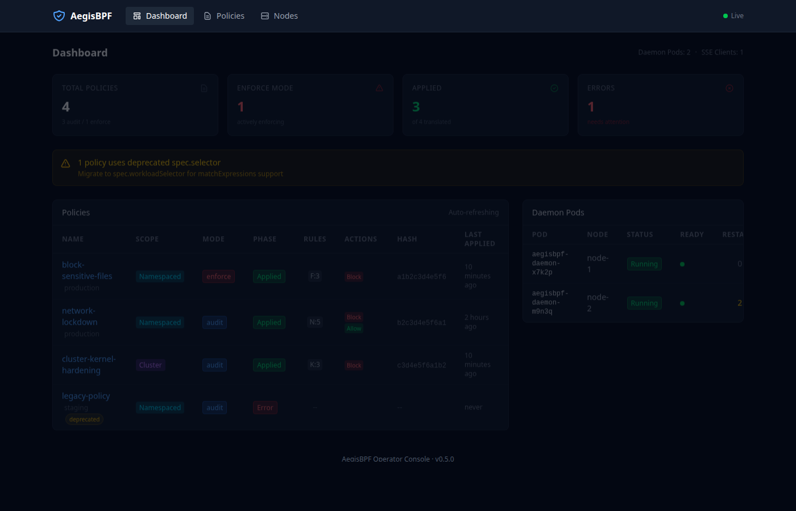
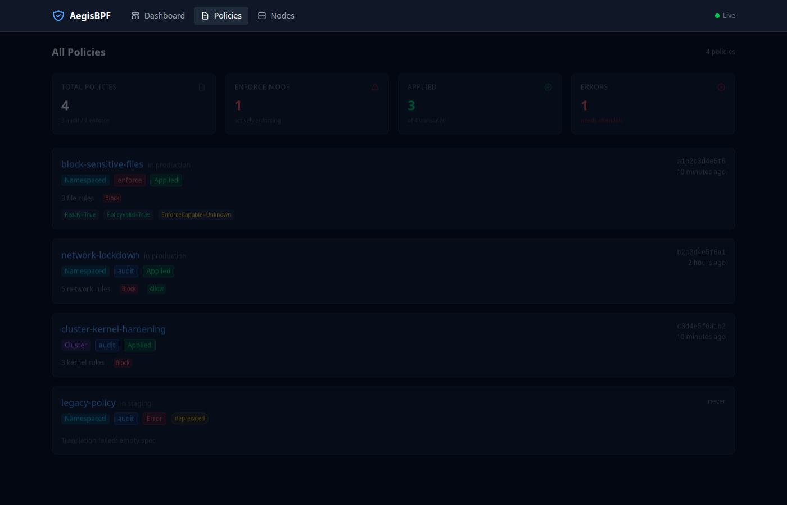
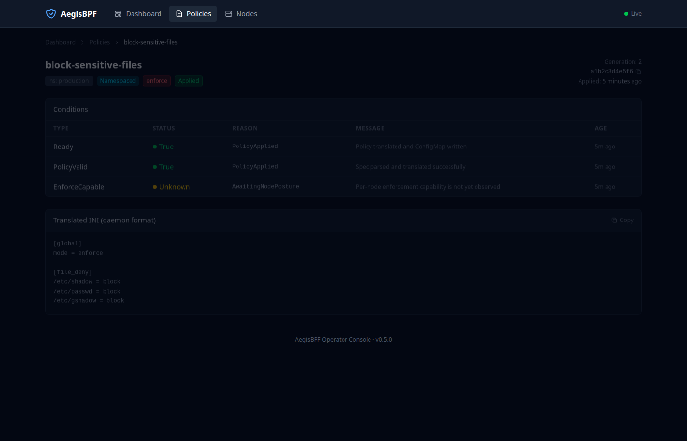
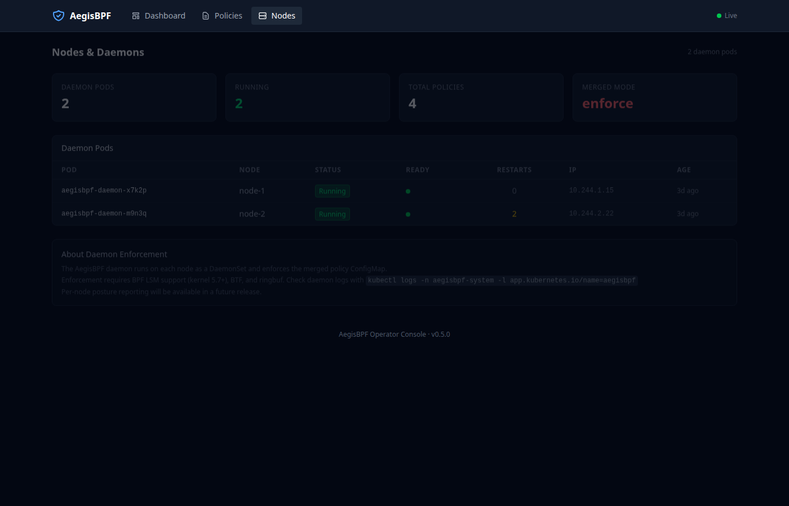

# AegisBPF

[](https://github.com/ErenAri/Aegis-BPF/actions/workflows/ci.yml)
[]()
[]()
[]()
[]()

**AegisBPF** is an eBPF-based runtime security agent that monitors and blocks unauthorized file and network activity using Linux Security Modules (LSM). It provides kernel-level enforcement for file deny rules plus outbound and selected inbound network deny surfaces, with an explicit audit-only fallback when enforce-capable hooks are unavailable.

### Positioning

AegisBPF is an **enforcement-first** eBPF runtime security engine for Linux
workloads. Unlike Falco and Tracee (detection-only) or Tetragon (signal-based
enforcement via `SIGKILL`), AegisBPF uses BPF-LSM `-EPERM` returns with
IMA-backed exec identity for **deterministic, in-kernel prevention**, and
ships with first-class OverlayFS copy-up handling, dual-stack CIDR network
deny, cgroup-scoped policy, and a dedicated priority ring buffer for
forensic-grade evidence.

Where it fits on the runtime-security map:

```
                              ENFORCE
                                │
                    KubeArmor   │   Tetragon (signal)
                   ┌────────────┼────────────┐
                   │  AegisBPF  │  AegisBPF  │
          POLICY ──┼────────────┼────────────┼── OBSERVE
          (static) │            │            │  (pattern-match)
                   │            │            │
                   │   (none)   │  Falco     │
                   │            │  Tracee    │
                   └────────────┼────────────┘
                                │
                              DETECT
```

```
┌───────────────────────────────────────────────────────────────────────────────┐
│                              AegisBPF                                         │
│                                                                               │
│   ┌──────────┐  ┌──────────┐  ┌──────────┐  ┌──────────┐  ┌──────────┐        │
│   │ File/Net │  │  Allow   │  │ Policy   │  │ Metrics  │  │ Plugins  │        │
│   │deny rules│  │ allowlist│  │+ signing │  │+ health  │  │+ rules   │        │
│   └────┬─────┘  └────┬─────┘  └────┬─────┘  └────┬─────┘  └────┬─────┘        │
│        └─────────────┴─────────────┴─────────────┴─────────────┘              │
│                                      │                                        │
│                              ┌───────┴────────┐                               │
│                              │ Pinned BPF Maps│                               │
│                              │ + Ring Buffer  │                               │
│                              └───────┬────────┘                               │
│                                      │                                        │
├──────────────────────────────────────┼────────────────────────────────────────┤
│                               KERNEL │                                        │
│                         ┌────────────┴──────────────┐                         │
│                         │ LSM hooks (enforce/audit) │                         │
│                         │ file_open/inode_permission│                         │
│                         │ inode_copy_up (overlayfs) │                         │
│                         │ bprm_check (+ IMA hash)   │                         │
│                         │ socket_connect/socket_bind│                         │
│                         │ socket_listen/socket_accept│                        │
│                         │ socket_sendmsg/recvmsg    │                         │
│                         └────────────┬──────────────┘                         │
│                         ┌────────────┴─────────────┐                          │
│                         │ Tracepoint fallback      │                          │
│                         │ openat/exec/fork/exit    │                          │
│                         └──────────────────────────┘                          │
└───────────────────────────────────────────────────────────────────────────────┘
```

## Features

- **Kernel-level blocking** - Uses BPF LSM hooks to block file opens before they complete
- **Inode-based rules** - Block by device:inode for reliable identification across renames
- **Path-based rules** - Block by file path for human-readable policies
- **OverlayFS copy-up propagation** - LSM `inode_copy_up` hook detects when denied lower-layer inodes are promoted to the upper layer (containers/overlay-on-overlay) and propagates the deny rule to the new inode
- **Dual-stack network policy** - Deny IPv4/IPv6 exact IP, CIDR, port, and IP:port rules in kernel hooks
- **Full socket lifecycle coverage** - `connect()`, `bind()`, port-oriented `listen()`, accepted-peer `accept()`, outbound `sendmsg()`, and inbound `recvmsg()` when the corresponding kernel hooks are available
- **Cgroup-scoped deny rules** - `deny_cgroup_inode` / `deny_cgroup_ipv4` / `deny_cgroup_port` allow per-workload deny rules so the same binary or endpoint can be allowed for one cgroup and denied for another
- **Cgroup allowlisting** - Exempt trusted workloads from deny rules
- **Audit mode** - Monitor without blocking (works without BPF LSM)
- **Emergency kill switch** - Single-command enforcement bypass that preserves audit/telemetry and emits an auditable trail
- **Capability reporting + enforce gating** - `capabilities.json` + explicit fail-closed vs audit-fallback enforcement posture
- **Prometheus metrics** - Export block counts and statistics
- **Structured logging** - JSON or text output to stdout/journald
- **Policy files and signed bundles** - Declarative configuration with SHA256 verification and signature enforcement
- **Kubernetes ready** - Helm chart for DaemonSet deployment
- **Per-hook latency tracking** - PERCPU_ARRAY map records overhead per LSM hook for benchmarking
- **In-kernel event pre-filtering** - Approver/discarder maps suppress noisy events before they reach userspace
- **Priority ring buffer** - Dedicated 4 MB ring buffer for forensic security events
- **Forensic event capture** - Enriched block events with UID/GID, exec identity, and process context
- **Startup self-tests** - Validates map accessibility, config readability, and ring buffer health on boot
- **Map capacity monitoring** - Warns when BPF map usage approaches configured limits
- **Process cache reconciliation** - Scans /proc at startup to populate process tree for pre-existing processes
- **BPF object signing** - SHA-256 hash verification with Ed25519 signature preparation
- **Binary hash verification** - Integrity checks for allow-listed binaries
- **IMA-backed exec trust (kernel 6.1+)** - Optional `bpf_ima_file_hash()` integration verifies executables against a SHA-256 trust map (`trusted_exec_hash`) inside `bprm_check_security`
- **Deep process lineage** - Process tree records ancestor PIDs for richer rule matching and post-mortem correlation, with retained metadata for recently exited processes
- **UID-to-username identity resolution** - Forensic events resolve uid/gid into username/groupname for SIEM-friendly alerts
- **Validating admission webhook** - Operator-side validating webhook + selector-based filtering and merged policy reconciler for safer Kubernetes rollouts
- **Hot-loadable detection rules** - JSON-based rule engine with comm/path/ancestor/cgroup matching and hot-reload
- **Plugin/extension system** - Virtual event handler interface for custom processing pipelines
- **Operator web console** - Lightweight htmx + SSE dashboard for policy status, daemon health, and real-time events (zero JS framework dependencies)

## Web Console

The operator includes a built-in web console for monitoring policy status, daemon health, and real-time events. Enable it with `--enable-console` on the operator binary.

| Dashboard | Policies |
|-----------|----------|
|  |  |

| Policy Detail | Nodes & Daemons |
|---------------|-----------------|
|  |  |

- Server-rendered HTML with [htmx](https://htmx.org/) for partial page updates
- Server-Sent Events for live push updates
- Tailwind CSS dark theme (CDN, no build step)
- Zero JavaScript framework dependencies
- Embedded in the operator binary via `go:embed`

## Comparison with Other Tools

### Architecture & feature matrix

Legend: ✅ full · ◐ partial · ❌ absent

| Capability | AegisBPF | Falco | Tetragon | Tracee | KubeArmor |
|---|---|---|---|---|---|
| **Category** | Enforcement-first | Detect-only HIDS | Observe + enforce | Forensics + detect | Enforce-first (LSM-unified) |
| **CNCF status** | — | Graduated (2024) | Sub-project of Graduated Cilium | — | Sandbox |
| BPF LSM enforcement (`-EPERM`) | ✅ 15 hooks | ❌ | ✅ (`security_*`) | ❌ | ✅ |
| Signal-based enforcement (SIGKILL) | ◐ escalation | ❌ | ✅ | ❌ | ❌ |
| AppArmor / SELinux fallback | ❌ | ❌ | ❌ | ❌ | ✅ |
| Tracepoint audit when LSM absent | ✅ | ✅ | ✅ | ✅ | ◐ |
| File enforcement | ✅ Kernel deny | ❌ Detect only | ✅ | ◐ | ✅ |
| Network enforcement (full socket lifecycle) | ✅ connect/bind/listen/accept/sendmsg/recvmsg | ❌ | ✅ | ◐ | ◐ |
| **OverlayFS `inode_copy_up` propagation** | ✅ | ❌ | ❌ | ❌ | ❌ |
| **IMA-backed trusted exec** (kernel 6.1+) | ✅ `bpf_ima_file_hash` | ❌ | ◐ | ❌ | ❌ |
| Process ancestry + argv | ✅ 4 MB priority ringbuf | ◐ | ✅ | ✅ | ◐ |
| Cgroup-scoped policy | ✅ inode / IPv4 / port | ◐ | ✅ | ◐ | ✅ |
| LPM CIDR v4/v6 network deny | ✅ | ◐ | ✅ | ◐ | ◐ |
| Ptrace / module-load / BPF syscall blocking | ✅ all three | ❌ | ◐ | ❌ | ◐ |
| Policy evaluation | O(1) BPF map lookup | O(rules) userspace | In-kernel TracingPolicy | Hybrid signatures | In-kernel + userspace |
| Policy language | INI + K8s CRD | YAML DSL | K8s CRD TracingPolicy | Rego / Go signatures | K8s CRD KubeArmorPolicy |
| Break-glass / deadman-TTL | ✅ Emergency + revert | ❌ | ❌ | ❌ | ❌ |
| CO‑RE + BTF | ✅ | ✅ | ✅ | ✅ | ✅ |
| BTFhub fallback (kernels w/o BTF) | ❌ (roadmap) | ✅ | ✅ | ✅ | ✅ |
| Kubernetes CRD + validating webhook | ✅ v1alpha1 | ◐ | ✅ v1 | ◐ | ✅ |
| Signed policies (Ed25519 / cosign) | ✅ Ed25519 | ❌ | ◐ | ❌ | ◐ |
| Signed BPF objects | ◐ (hash verify today, sig prep) | ❌ | ❌ | ❌ | ❌ |
| SBOM (SPDX + CycloneDX) | ✅ both | ✅ | ✅ | ✅ | ✅ |
| SLSA L3 build provenance | ❌ (roadmap) | ✅ | ✅ | ✅ | ◐ |
| MITRE ATT&CK rule tags | ❌ (roadmap) | ✅ | ◐ | ◐ | ◐ |
| CIS / NIST / PCI mappings | ✅ docs/compliance/ | ✅ | ◐ | ◐ | ✅ |
| Prometheus metrics | ✅ | ✅ | ✅ | ✅ | ✅ |
| OpenTelemetry OTLP | ✅ | ◐ | ✅ | ◐ | ◐ |
| OCSF / ECS / CEF event schema | ❌ (roadmap; custom JSON + ECS today) | ✅ | ◐ | ✅ | ◐ |
| SIEM integrations (Splunk / Elastic / OTLP) | ✅ | ✅ Falcosidekick | ◐ JSON | ◐ JSON | ◐ JSON |
| Multi-cluster control plane | ❌ (roadmap) | ◐ | ◐ (Isovalent Ent) | ❌ | ◐ (AccuKnox) |
| Community rule library | ❌ (roadmap) | ✅ large | ◐ | ◐ | ◐ |
| 3rd-party security audit | ❌ (roadmap) | ✅ | ✅ | ◐ | ◐ |
| Runtime | C++20 + C (BPF), single binary | C++ | Go | Go | Go |

### Where AegisBPF is uniquely differentiated today

- **OverlayFS copy-up propagation.** No other open-source runtime
  security agent enforces on `lsm/inode_copy_up`. This closes a
  real container-escape bypass class.
- **IMA-backed trusted exec identity.** Kernel 6.1+ `bpf_ima_file_hash()`
  integration ties allow-listed execs to cryptographic file hashes inside
  `bprm_check_security`.
- **Deterministic LSM `-EPERM` + signal escalation.** Per-policy choice
  between fail-closed LSM denial, `SIGTERM`, or escalated `SIGKILL` with
  a configurable rate/window.
- **Break-glass + deadman TTL.** Revert to audit in one command; auto-revert
  on deny-rate spikes; emergency override emits an auditable trail.
- **Dedicated forensic priority ring buffer.** 4 MB ring buffer reserved for
  enriched block events (UID/GID, exec identity, ancestor PIDs, cgroup),
  separate from the 8 MB general-event buffer.

### Measured performance (same host, same kernel, same run)

The following numbers were produced by [`scripts/compare_runtime_security.sh`](scripts/compare_runtime_security.sh)
on a single host (i9-13900H, kernel 6.17, Ubuntu 24.04) with each agent
running in isolation under an empty/minimal policy. Full methodology:
[`docs/COMPETITIVE_BENCH_METHODOLOGY.md`](docs/COMPETITIVE_BENCH_METHODOLOGY.md).

**File I/O** (`open` -> `read` -> `close`, 200 000 iterations):

| Agent | us/op | p50 (us) | p99 (us) | Delta vs bare |
|---|---|---|---|---|
| none (baseline) | 1.69 | 1.56 | 2.53 | -- |
| **AegisBPF** | 1.68 | 1.58 | 2.42 | **-0.59%** |
| Tetragon | 1.63 | 1.52 | 2.27 | -3.55% |
| Falco | 2.33 | 2.20 | 3.47 | **+37.87%** |

**Network** (`socket` -> `connect` -> `close`, 200 000 iterations):

| Agent | us/op | p50 (us) | p99 (us) | Delta vs bare |
|---|---|---|---|---|
| none (baseline) | 3.62 | 2.66 | 7.38 | -- |
| **AegisBPF** | 3.87 | 2.67 | 8.18 | **+6.91%** |
| Tetragon | 3.74 | 2.89 | 7.18 | +3.31% |
| Falco | 4.44 | 3.47 | 8.56 | **+22.65%** |

**Exec** (`fork` -> `execve(/bin/true)` -> `waitpid`, 5 000 iterations):

| Agent | us/op | p50 (us) | p99 (us) | Delta vs bare |
|---|---|---|---|---|
| none (baseline) | 279.33 | 244.98 | 619.09 | -- |
| **AegisBPF** | 246.77 | 236.82 | 417.77 | -11.66% |
| Tetragon | 251.07 | 239.23 | 430.46 | -10.12% |
| Falco | 245.54 | 235.24 | 405.85 | -12.10% |

**Key takeaways:**
- **File I/O:** AegisBPF and Tetragon are within noise of baseline. Falco adds +38% from its userspace rule engine.
- **Network:** AegisBPF at +6.9% reflects its 6 socket lifecycle hooks. Tetragon +3.3%, Falco +22.7%.
- **Exec:** All agents within noise (~250 us/op). The per-op cost dwarfs agent overhead.
- Negative deltas are measurement variance, not real speedups.

Reproduce: `sudo scripts/compare_runtime_security.sh --agents none,aegisbpf,falco,tetragon --workload open_close`

Raw data: [`evidence/comparison/`](evidence/comparison/) | Full analysis: [`docs/PERFORMANCE_COMPARISON.md`](docs/PERFORMANCE_COMPARISON.md)

## Claim Taxonomy

To avoid overclaiming, features are labeled as:

- `ENFORCED`: operation is denied in-kernel in supported mode
- `AUDITED`: operation is observed/logged but not denied
- `PLANNED`: not shipped yet

Current flagship contract:

> Block unauthorized file opens/reads using inode-first enforcement for
> cgroup-scoped workloads, with safe rollback and signed policy provenance.

Current scope labels:
- `ENFORCED`: file deny via LSM (`file_open` / `inode_permission`), OverlayFS
  copy-up propagation via `inode_copy_up`, outbound network deny for configured
  `connect()` / `sendmsg()` rules, inbound `recvmsg()` deny, port-oriented
  `bind()` / `listen()` deny, accepted-peer `accept()` deny, cgroup-scoped
  inode/IPv4/port deny rules, and IMA-backed exec hash trust on kernel 6.1+
  when those LSM hooks/helpers are available
- `AUDITED`: tracepoint fallback path (no syscall deny), detailed metrics mode,
  forensic block events with UID/username and exec identity
- `PLANNED`: broader runtime surfaces beyond current documented hooks

## Validation Results

**Latest Validation Snapshot:**
- Independent environment validation: 2026-02-07 (Google Cloud Platform, kernel 6.8.0-1045-gcp)
- Local full regression run: 2026-02-15 (`ctest --test-dir build-prod --output-on-failure --timeout 180`)
- Latest focused maintenance verification: 2026-03-20 (daemon/policy/metrics/command suites plus contract checks after modular refactors)

| Test Category | Result | Details                                                                                                                       |
|---------------|--------|-------------------------------------------------------------------------------------------------------------------------------|
| **Unit + Contract Tests** |  217/217 PASS | Full local `ctest` run on 2026-02-16                                                                                          |
| **E2E Tests** |  100% PASS | Smoke (audit/enforce), chaos, enforcement matrix                                                                              |
| **Security Validation** | 3/3 PASS | Enforcement blocks access, symlinks/hardlinks can't bypass                                                                    |
| **Performance Impact** |  Gate-enforced | Self-hosted perf gate (`perf.yml`): open microbench <=10% (audit-only, empty deny policy), workload budgets in `docs/PERF.md` |
| **Binary Hardening** |  VERIFIED | FORTIFY_SOURCE, stack-protector, PIE, full RELRO                                                                              |

**Security Hardening Applied:**
- Compiler security flags (FORTIFY_SOURCE=2, stack-protector-strong, PIE, RELRO)
- Timeout protection on BPF operations (prevents indefinite hangs)
- Secure temporary file creation via `mkstemp()` (symlink-attack resistant)
- Atomic file writes (write-rename pattern) for all persistent state
- Trusted key directory permission validation with symlink rejection
- Break-glass token cryptographic validation (Ed25519 + expiry)
- Auto-revert to audit-only on deny-rate spikes (configurable threshold)
- BPF map entry count verification after policy apply (crash-safe rollback)
- Thread-safe time formatting (`localtime_r`/`gmtime_r`)
- Seccomp allowlist hardened (removed `SYS_execve`, replaced `popen` with zlib)
- O(1) cgroup path resolution via `open_by_handle_at`
- BpfState move semantics fully correct (no dangling pointers)
- Compile-time struct layout assertions (BPF/userspace size + offset checks)

**Remaining Recommendations Before Production:**
1. Run in audit mode for 1+ weeks before enabling enforcement
2. Document recovery procedures for enforcement misconfiguration

Full validation report available in CI artifacts and `docs/VALIDATION_2026-02-07.md`.

## Evidence & CI

Public proof lives in the docs and CI artifacts:
- Evidence checklist and gates: `docs/PRODUCTION_READINESS.md`
- Kernel/CI execution model: `docs/CI_EXECUTION_STRATEGY.md`
- Kernel/distro compatibility: `docs/COMPATIBILITY.md`
- Threat model + non-goals: `docs/THREAT_MODEL.md`
- Enforcement guarantees + TOCTOU analysis: `docs/GUARANTEES.md`
- Enforce posture guarantees contract: `docs/ENFORCEMENT_GUARANTEES.md`
- Emergency control contract: `docs/EMERGENCY_CONTROL_CONTRACT.md`
- Capability/posture contract: `docs/CAPABILITY_POSTURE_CONTRACT.md`
- Helm enforce-gating contract: `docs/HELM_ENFORCE_GATING_CONTRACT.md`
- Kubernetes mixed-mode rollout: `docs/K8S_ROLLOUT_AUDIT_ENFORCE.md`
- Kubernetes RBAC guidance: `docs/KUBERNETES_RBAC.md`
- Performance profile + tuning: `docs/PERFORMANCE.md`
- Policy semantics contract: `docs/POLICY_SEMANTICS.md`
- Enforcement semantics whitepaper: `docs/ENFORCEMENT_SEMANTICS_WHITEPAPER.md`
- Edge-case compliance suite: `docs/EDGE_CASE_COMPLIANCE_SUITE.md`
- Edge-case compliance results: `docs/EDGE_CASE_COMPLIANCE_RESULTS.md`
- External validation status: `docs/EXTERNAL_VALIDATION.md`
- Performance baseline report: `docs/PERF_BASELINE.md`
- Performance comparison (measured): `docs/PERFORMANCE_COMPARISON.md`
- Competitive benchmark methodology: `docs/COMPETITIVE_BENCH_METHODOLOGY.md`
- Comparison & soak roadmap: `docs/COMPARISON_AND_SOAK_PLAN.md`
- Architecture support matrix: `docs/ARCHITECTURE_SUPPORT.md`
- BPF map schema reference: `docs/BPF_MAP_SCHEMA.md`

**Compliance Frameworks:**
- NIST SP 800-53 Rev. 5: `docs/compliance/NIST_800_53_MAPPING.md`
- ISO/IEC 27001:2022: `docs/compliance/ISO_27001_CONTROLS.md`
- SOC 2 Type II evidence kit: `docs/compliance/SOC2_EVIDENCE_KIT.md`
- PCI DSS 4.0: `docs/compliance/PCI_DSS_4_MAPPING.md`
- CIS Kubernetes Benchmark v1.8: `docs/compliance/CIS_KUBERNETES_BENCHMARK.md`

**Integrations:**
- Grafana dashboards (4): `grafana/dashboards/`
- Prometheus alerting rules: `examples/prometheus-alerts.yml`
- Splunk HEC forwarder: `integrations/siem/splunk-hec-forwarder.py`
- Elastic ECS formatter: `integrations/siem/elastic-ecs-formatter.py`
- OpenTelemetry OTLP exporter: `integrations/opentelemetry/`

**Tutorials:**
- [Block your first file](tutorials/01-block-first-file.md)
- [Network policy enforcement](tutorials/02-network-policy.md)
- [Writing custom policies](tutorials/03-custom-policies.md)
- [Debugging policy denials](tutorials/04-debugging-denials.md)

Kernel-matrix artifacts are uploaded by `.github/workflows/kernel-matrix.yml`
as `kernel-matrix-<runner>` (kernel + distro + test logs).

## Architecture

```
+----------------------------- User Space -----------------------------+
|                                                                      |
|  +----------------------------------------------------------------+  |
|  |                       aegisbpf daemon                          |  |
|  |                                                                |  |
|  | +------+ +-------+ +-------+ +------+ +-----+ +------+ +------+|  |
|  | | CLI  | |Policy | |Event  | |Metric| | Log | |Plugin| |Rules ||  |
|  | | Disp | |+ Sign | |Handler| |Health| |(JSON| |System| |Engine||  |
|  | +------+ +-------+ +-------+ +------+ +-----+ +------+ +------+|  |
|  +----------------------------------------------------------------+  |
|                                |                                     |
|                         +------+------+                              |
|                         |   libbpf    |                              |
|                         +------+------+                              |
|                                |                                     |
+--------------------------------|-------------------------------------+
                          bpf() syscall
+--------------------------------|-------------------------------------+
|                                |            Kernel Space             |
|  +-----------------------------+-----------------------------+       |
|  |                      BPF Subsystem                        |       |
|  |                                                           |       |
|  |  +------------------------+ +---------------------------+ |       |
|  |  |      LSM Hooks         | |   Tracepoint Fallback     | |       |
|  |  | file_open              | | openat / exec / fork      | |       |
|  |  | inode_permission       | | (audit when no BPF LSM)   | |       |
|  |  | inode_copy_up          | +---------------------------+ |       |
|  |  | bprm_check_security    |                               |       |
|  |  |   (+ IMA hash, 6.1+)   |                               |       |
|  |  | socket_connect / bind  |                               |       |
|  |  | socket_listen / accept |                               |       |
|  |  | socket_sendmsg/recvmsg |                               |       |
|  |  +------------------------+                               |       |
|  |                                                           |       |
|  |  +------------------------------------------------------+ |       |
|  |  |                     BPF Maps                         | |       |
|  |  | deny_* / allow_*    net_* / survival_*               | |       |
|  |  | deny_cgroup_inode/ipv4/port  trusted_exec_hash       | |       |
|  |  | agent_meta / stats  events ring buffer               | |       |
|  |  +------------------------------------------------------+ |       |
|  +-----------------------------------------------------------+       |
|                                                                      |
|              file/network ops: allowed, audited, or blocked          |
+----------------------------------------------------------------------+
```

## Standards Alignment

| Area | Standard | Status |
|---|---|---|
| Kernel enforcement | BPF LSM (`CONFIG_BPF_LSM`, kernel ≥ 5.7) | ✅ 15 hooks attached |
| Portability | CO‑RE + BTF | ✅ (min kernel 5.15) |
| Portability | BTFhub fallback for kernels without `/sys/kernel/btf/vmlinux` | Roadmap |
| Supply chain | SBOM (SPDX 2.3 + CycloneDX 1.6) | ✅ published per release |
| Supply chain | SLSA v1.0 L3 build provenance | Roadmap (L1 today) |
| Supply chain | cosign / Sigstore signatures | Roadmap |
| Supply chain | OpenSSF Best Practices Badge | Roadmap |
| Supply chain | OpenSSF Scorecard | Roadmap |
| Daemon hardening | seccomp-bpf allowlist | ✅ |
| Daemon hardening | Landlock self-sandbox | Roadmap |
| Daemon hardening | Split capabilities (`CAP_BPF` + `CAP_PERFMON`) | Roadmap (root today) |
| Compliance | NIST SP 800‑53 Rev 5 control mapping | ✅ `docs/compliance/NIST_800_53_MAPPING.md` |
| Compliance | NIST SP 800‑190 (container security) | Roadmap |
| Compliance | ISO/IEC 27001:2022 | ✅ `docs/compliance/ISO_27001_CONTROLS.md` |
| Compliance | SOC 2 Type II evidence kit | ✅ `docs/compliance/SOC2_EVIDENCE_KIT.md` |
| Compliance | PCI DSS 4.0 | ✅ `docs/compliance/PCI_DSS_4_MAPPING.md` |
| Compliance | CIS Kubernetes Benchmark v1.8 | ✅ `docs/compliance/CIS_KUBERNETES_BENCHMARK.md` |
| Compliance | MITRE ATT&CK for Containers / Linux | Roadmap (rule tags) |
| Event schema | OCSF 1.1 / ECS / CEF | Roadmap (custom JSON + ECS formatter today) |
| Community | CNCF Sandbox → Incubating → Graduated | Pre-sandbox |

Full compliance mappings live under [`docs/compliance/`](docs/compliance/).
Detailed gap analysis and professional-product roadmap:
[`docs/POSITIONING.md`](docs/POSITIONING.md).

## Honest Limitations

Professional security products admit their limits. These are AegisBPF's,
in priority order. Each is tracked in [`docs/POSITIONING.md`](docs/POSITIONING.md).

1. **TOCTOU on path-based rules.** Pathname → inode resolution can be
   swapped between `inode_permission` and `file_open`. Path rules are
   **detection-grade**; inode and IMA-hash rules are **prevention-grade**.
   See [`docs/GUARANTEES.md`](docs/GUARANTEES.md).
2. **Verifier / complexity limits.** Very large rulesets may hit BPF's
   1M-instruction or 4K-stack caps. A policy compiler that partitions
   large rulesets across tail-called programs is on the roadmap.
3. **`socket_listen` / `socket_recvmsg` are kernel-version-gated.**
   Runtime probing today; a machine-readable capability report is on
   the roadmap.
4. **Single-node control plane.** One operator pod per cluster; no fleet
   view across clusters yet.
5. **Policy language is INI + CRD only.** No CEL/Rego expressions, no
   parent-process / label selectors in match criteria yet.
6. **No BTFhub fallback.** Kernels without `/sys/kernel/btf/vmlinux`
   (RHEL 7, very old embedded) are unsupported.
7. **No distro packages yet.** Install requires build-from-source or
   the provided container image; Ubuntu PPA / Fedora COPR are on the
   roadmap.
8. **Daemon runs as root for its full lifetime.** It should drop to
   `CAP_BPF` + `CAP_PERFMON` after BPF load; tracked on roadmap.
9. **No third-party security audit yet.** Planned before v1.0 GA.
10. **Linux only.** Windows (`ebpf-for-windows`) is a v2.0 consideration;
    macOS is an explicit non-goal.

## Quick Start

### Prerequisites

- Linux kernel 5.8+ with BTF support
- BPF LSM enabled for enforce mode (check: `cat /sys/kernel/security/lsm | grep bpf`)
- Cgroup v2 mounted at `/sys/fs/cgroup`

Optional environment check:
```bash
scripts/verify_env.sh --strict
```

### Install Dependencies (Ubuntu/Debian)

```bash
sudo apt-get update
sudo apt-get install -y clang llvm libbpf-dev libsystemd-dev \
    pkg-config cmake ninja-build python3-jsonschema linux-tools-common
sudo apt-get install -y "linux-tools-$(uname -r)" || true
```

### Build

```bash
cmake -S . -B build -G Ninja
cmake --build build
```

### Run

```bash
# Audit mode (observe without blocking)
sudo ./build/aegisbpf run --audit

# Enforce mode (block matching file opens)
sudo ./build/aegisbpf run --enforce

# Enforce mode with explicit signal policy (default is SIGTERM)
sudo ./build/aegisbpf run --enforce --enforce-signal=term

# Allow unknown exec identity only as a break-glass exception
sudo ./build/aegisbpf run --enforce --allow-unknown-binary-identity

# Fail closed if enforce mode degrades to audit/degraded state
sudo ./build/aegisbpf run --enforce --strict-degrade

# SIGKILL mode escalates: TERM first, KILL only after repeated denies
sudo ./build/aegisbpf run --enforce --enforce-signal=kill

# Tune SIGKILL escalation policy (used only with --enforce-signal=kill)
sudo ./build/aegisbpf run --enforce --enforce-signal=kill \
  --kill-escalation-threshold=8 \
  --kill-escalation-window-seconds=60

# With JSON logging
sudo ./build/aegisbpf run --log-format=json

# Select LSM hook (default: file_open)
sudo ./build/aegisbpf run --enforce --lsm-hook=both

# Increase ring buffer and sample events to reduce drops under heavy load
sudo ./build/aegisbpf run --audit --ringbuf-bytes=67108864 --event-sample-rate=10
```

## Code Layout

Recent maintenance work split the old hotspot files into narrower modules:

- Daemon orchestration stays in `src/daemon.cpp`, with capability reporting in
  `src/daemon_posture.cpp`, runtime-state and heartbeat handling in
  `src/daemon_runtime.cpp`, and enforce gating in
  `src/daemon_policy_gate.cpp`.
- BPF lifecycle code stays in `src/bpf_ops.cpp`, with attach orchestration in
  `src/bpf_attach.cpp`, map and shadow helpers in `src/bpf_maps.cpp`,
  integrity checks in `src/bpf_integrity.cpp`, and config/agent-meta handling
  in `src/bpf_config.cpp`.
- Policy parsing and runtime application now live in `src/policy_parse.cpp`
  and `src/policy_runtime.cpp`.
- Monitoring-facing commands were split into focused modules such as
  `src/commands_health.cpp`, `src/commands_probe.cpp`,
  `src/commands_explain.cpp`, and `src/commands_metrics.cpp`.
- Quality and observability modules: `src/selftest.cpp` (startup validation),
  `src/map_monitor.cpp` (capacity warnings), `src/proc_scan.cpp` (/proc
  reconciliation).
- Security modules: `src/bpf_signing.cpp` (BPF object integrity),
  `src/binary_hash.cpp` (allow-list hash verification).
- Extension modules: `src/rule_engine.cpp` (hot-loadable detection rules),
  `src/plugin.cpp` (event handler plugin system).
- BPF kernel-side code split into per-subsystem headers: `bpf/aegis_common.h`
  (shared types/helpers), `bpf/aegis_file.bpf.h` (file hooks),
  `bpf/aegis_exec.bpf.h` (exec hooks), `bpf/aegis_net.bpf.h` (network hooks),
  `bpf/aegis_process.bpf.h` (process lifecycle).

## How It Works

```
                    File Access Blocking Flow

  User Process              Kernel (BPF LSM)
       |
       |  open("/etc/shadow")
       |----------------------->|
       |                        |
       |                 allow_cgroup? ----yes----> ALLOW
       |                        |no
       |                        v
       |                   deny_inode? ----yes--+
       |                        |no             |
       |                        v               v
       |                 survival_allowlist? -> ALLOW
       |                        |no
       |                        v
       |                 audit mode?
       |                  /          \
       |                yes           no
       |                 |             |
       |            emit event     signal + -EPERM
       |              ALLOW          DENY
       |                        |
       |<-----------------------|
       |  Success / EPERM
```

## Usage

### Run Options

```bash
# Choose LSM hook (default: file_open)
sudo aegisbpf run --enforce --lsm-hook=file
sudo aegisbpf run --enforce --lsm-hook=inode
sudo aegisbpf run --enforce --lsm-hook=both

# Choose enforce signal action (default: term)
sudo aegisbpf run --enforce --enforce-signal=term
sudo aegisbpf run --enforce --enforce-signal=none
# 'kill' escalates to SIGKILL only after repeated denies in a short window
sudo aegisbpf run --enforce --enforce-signal=kill

# Tune escalation policy for kill mode
sudo aegisbpf run --enforce --enforce-signal=kill \
  --kill-escalation-threshold=8 \
  --kill-escalation-window-seconds=60

# Increase ring buffer size (bytes) to reduce ringbuf drops
sudo aegisbpf run --audit --ringbuf-bytes=67108864

# Sample block events (1 = all events, 10 = 1 out of 10)
sudo aegisbpf run --audit --event-sample-rate=10

# In enforce mode, exit non-zero on fallback/degraded runtime state
sudo aegisbpf run --enforce --strict-degrade
```

### Performance and Soak (Sample Results)

Results vary by host and workload. The latest self-hosted baseline is tracked in `docs/PERF_BASELINE.md`.

```text
# perf_compare.sh (200,000 ops, FILE=/etc/hosts, i9-13900H, kernel 6.17)
baseline_us_per_op=1.69
with_agent_us_per_op=1.68
delta_pct=-0.59

# KPI ratios (p95)
open_p95_ratio=0.787    (target <= 1.05)
connect_p95_ratio=0.994 (target <= 1.05)

# Soak (audit + enforce mode, file + network workload)
ringbuf_drops_delta=0
```

For head-to-head comparison against Falco and Tetragon, see [Comparison with Other Tools](#comparison-with-other-tools).

**Soak testing infrastructure:**
- `scripts/soak_reliability.sh` -- audit + enforce mode, file + network workload, RSS/drop/ratio gates
- `scripts/aws_soak_24h.sh` -- automated 24-hour soak on AWS EC2 (~$0.28/day on t2.micro, self-terminating with SSH debug access)
- `.github/workflows/soak.yml` -- weekly CI: 1-hour audit soak, 15-min enforce soak, 5-min ASAN soak
- **First 24-hour AWS soak: PASSED (2026-04-17)** -- `t2.micro`, audit mode, file + UDP workload; 88 kB RSS growth over 24 h, 0 ringbuf drops across 3.36 M decision events. Full writeup: [`docs/SOAK_24H.md`](docs/SOAK_24H.md), raw artifacts: [`evidence/soak-24h/`](evidence/soak-24h/).

### Block Commands

```bash
# Add file to deny list
sudo aegisbpf block add /usr/bin/malware

# List all blocked entries
sudo aegisbpf block list

# Remove from deny list
sudo aegisbpf block del /usr/bin/malware

# Clear all rules and statistics
sudo aegisbpf block clear
```

### Allow Commands

```bash
# Allow cgroup (processes bypass deny rules)
sudo aegisbpf allow add /sys/fs/cgroup/system.slice

# List allowed cgroups
sudo aegisbpf allow list

# Remove from allowlist
sudo aegisbpf allow del /sys/fs/cgroup/system.slice
```

### Policy Files

```ini
# /etc/aegisbpf/policy.conf
version=5

[deny_path]
/usr/bin/dangerous
/opt/malware/binary

[deny_inode]
259:12345

[allow_cgroup]
/sys/fs/cgroup/system.slice
cgid:123456

[allow_binary_hash]
sha256:0123456789abcdef0123456789abcdef0123456789abcdef0123456789abcdef

# Protected resources (require VERIFIED_EXEC, see docs/VERIFIED_EXEC_CONTRACT.md)
[protect_connect]

[protect_runtime_deps]

# Optional hard gate: require host IMA appraisal when enforcing
[require_ima_appraisal]

[protect_path]
/etc/shadow
```

```bash
# Validate policy
sudo aegisbpf policy lint /etc/aegisbpf/policy.conf

# Apply with SHA256 verification
sudo aegisbpf policy apply /etc/aegisbpf/policy.conf --sha256 abc123...

# Apply signed bundle (recommended for production)
sudo aegisbpf policy apply /etc/aegisbpf/policy.signed --require-signature

# Export current rules
sudo aegisbpf policy export /tmp/current.conf

# Rollback to previous policy
sudo aegisbpf policy rollback
```

### Monitoring

```bash
# View statistics
sudo aegisbpf stats

# View detailed high-cardinality debug breakdowns
sudo aegisbpf stats --detailed

# Export Prometheus metrics
sudo aegisbpf metrics --out /var/lib/prometheus/aegisbpf.prom

# Export high-cardinality metrics for short-lived debugging
sudo aegisbpf metrics --detailed --out /tmp/aegisbpf.debug.prom

# Health check
sudo aegisbpf health

# Enable OTel-style policy spans in logs (for troubleshooting)
AEGIS_OTEL_SPANS=1 sudo aegisbpf policy apply /etc/aegisbpf/policy.conf
```

Daemon startup writes a capability/attach report to
`/var/lib/aegisbpf/capabilities.json` (override with
`AEGIS_CAPABILITIES_REPORT_PATH`). In enforce mode, startup fails closed if the
applied policy requires unavailable network, exec-identity, or runtime
dependency trust hooks (and, when configured, missing IMA appraisal posture).
The capability report also includes runtime posture fields (`runtime_state`,
`state_transitions`) so operators can distinguish `ENFORCE`,
`AUDIT_FALLBACK`, and `DEGRADED` outcomes.
For machine-readable posture compliance and Kubernetes scheduling labels, use:

```bash
python3 scripts/evaluate_capability_posture.py \
  --input /var/lib/aegisbpf/capabilities.json \
  --strict \
  --out-json /var/lib/aegisbpf/capabilities.posture.json \
  --out-labels-json /var/lib/aegisbpf/capabilities.labels.json
```

## Event Format

Events are emitted as newline-delimited JSON:

```json
{
  "type": "block",
  "pid": 12345,
  "ppid": 1000,
  "start_time": 123456789,
  "exec_id": "12345:123456789",
  "trace_id": "12345:123456789",
  "parent_start_time": 123400000,
  "parent_exec_id": "1000:123400000",
  "parent_trace_id": "1000:123400000",
  "cgid": 5678,
  "cgroup_path": "/sys/fs/cgroup/user.slice",
  "comm": "bash",
  "path": "/usr/bin/malware",
  "ino": 123456,
  "dev": 259,
  "action": "TERM"
}
```

Security-critical blocks emit enriched forensic events via the priority ring buffer:

```json
{
  "type": "forensic_block",
  "pid": 12351,
  "ppid": 12345,
  "start_time": 723456789,
  "exec_id": "12351:723456789",
  "cgid": 5678,
  "cgroup_path": "/sys/fs/cgroup/user.slice",
  "ino": 654321,
  "dev": 259,
  "uid": 1000,
  "gid": 1000,
  "exec_ino": 111222,
  "exec_dev": 259,
  "verified_exec": false,
  "exec_identity_known": true,
  "action": "KILL",
  "comm": "malware"
}
```

Runtime posture changes emit a separate event type:

```json
{
  "type": "state_change",
  "event_version": 1,
  "state": "AUDIT_FALLBACK",
  "reason_code": "CAPABILITY_AUDIT_ONLY",
  "detail": "kernel lacks required enforce hooks",
  "strict_mode": false,
  "transition_id": 2,
  "degradation_count": 1
}
```

## Deployment

### Docker

```bash
docker build -t aegisbpf .
docker run --privileged --pid=host \
    -v /sys/fs/bpf:/sys/fs/bpf \
    -v /sys/fs/cgroup:/sys/fs/cgroup:ro \
    -v /sys/kernel/btf:/sys/kernel/btf:ro \
    aegisbpf run --audit
```

### Kubernetes (Helm)

```bash
helm install aegisbpf ./helm/aegisbpf \
    --set agent.auditMode=false \
    --set agent.logFormat=json
```

### Systemd

```bash
sudo cmake --install build
sudo systemctl daemon-reload
sudo systemctl enable --now aegisbpf
```

`/etc/default/aegisbpf` defaults to:

- `AEGIS_REQUIRE_SIGNATURE=1`
- `AEGIS_POLICY=` (empty, service starts without applying a startup policy)

For production, set `AEGIS_POLICY` to a signed policy bundle path (for example
`/etc/aegisbpf/policy.signed`) and keep signature enforcement enabled.

## Data Flow Diagram

```
+----------------------------+
|    Policy bundle/rules     |
| /etc/aegisbpf/policy.signed|
+-------------+--------------+
              |
              v
+-------+  +------------------+  +------------------+
|  CLI  |->|    aegisbpf      |->| journald/stdout  |
|  Cmds |  |     daemon       |  | (structured logs)|
+-------+  +--------+---------+  +------------------+
                     |
                  bpf() syscall
                     |
           +---------+---------+
           |     BPF Maps      |
           |/sys/fs/bpf/aegisbpf/|
           |                   |
           | deny_* allow_*    |
           | deny_ipv4/ipv6    |
           | deny_cidr_v4/v6   |
           | deny_port         |
           | deny_cgroup_*     |
           | trusted_exec_hash |
           | net_*/block_stats |
           | survival/meta     |
           | events (ring buf) |
           | priority_events   |
           | hook_latency      |
           | event_approver_*  |
           +---------+---------+
                     |
           +---------+---------+
           | BPF hooks (kernel)|
           | - file_open       |
           | - inode_permission|
           | - inode_copy_up   |
           | - bprm_check (IMA)|
           | - socket_connect  |
           | - socket_bind     |
           | - socket_listen   |
           | - socket_accept   |
           | - socket_sendmsg  |
           | - socket_recvmsg  |
           | - tracepoints     |
           +-------------------+
```

## Metrics

AegisBPF exports Prometheus-compatible metrics:

| Metric | Type | Description |
|--------|------|-------------|
| `aegisbpf_blocks_total` | counter | Total blocked file opens |
| `aegisbpf_ringbuf_drops_total` | counter | Events dropped due to buffer overflow |
| `aegisbpf_deny_inode_entries` | gauge | Number of inode deny rules |
| `aegisbpf_deny_path_entries` | gauge | Number of path deny rules |
| `aegisbpf_allow_cgroup_entries` | gauge | Number of allowed cgroups |
| `aegisbpf_net_blocks_total` | counter | Blocked network operations by type (`connect`/`bind`/`listen`/`accept`/`sendmsg`/`recvmsg`) |
| `aegisbpf_net_ringbuf_drops_total` | counter | Dropped network events |
| `aegisbpf_net_rules_total` | gauge | Active network deny rules by type (`ip`/`cidr`/`port`/`cgroup_inode`/`cgroup_ipv4`/`cgroup_port`) |

High-cardinality debug metrics are available with `aegisbpf metrics --detailed`:
`aegisbpf_blocks_by_cgroup_total`, `aegisbpf_blocks_by_inode_total`,
`aegisbpf_blocks_by_path_total`, `aegisbpf_net_blocks_by_ip_total`,
`aegisbpf_net_blocks_by_port_total`.

## Security Hardening

```
+----------------------------------------------------------+
| Layer 5: Cryptographic                                   |
| Constant-time comparisons, BPF integrity, policy sigs    |
+----------------------------------------------------------+
| Layer 4: Code Signing                                    |
| Sigstore/Cosign + SBOM                                   |
+----------------------------------------------------------+
| Layer 3: MAC Policies                                    |
| AppArmor / SELinux                                       |
+----------------------------------------------------------+
| Layer 2: Seccomp                                         |
| Syscall allowlist (--seccomp)                            |
+----------------------------------------------------------+
| Layer 1: Capabilities                                    |
| CAP_SYS_ADMIN, CAP_BPF, CAP_PERFMON                      |
+----------------------------------------------------------+
```

**Cryptographic protections:**
- All hash comparisons use constant-time algorithms to prevent timing attacks
- BPF object integrity verified via SHA256 before loading
- Policy signing with Ed25519 signatures (recommended for production)

Enable all hardening layers:
```bash
sudo aegisbpf run --enforce --seccomp
```

See [SECURITY.md](SECURITY.md) for vulnerability reporting, environment variables, and hardening details.

Security boundaries, attacker model, and known blind spots are documented in
[docs/THREAT_MODEL.md](docs/THREAT_MODEL.md).  Enforcement guarantees and
TOCTOU analysis are in [docs/GUARANTEES.md](docs/GUARANTEES.md).

## Documentation

### Core Documentation

| Document | Description |
|----------|-------------|
| [ARCHITECTURE.md](docs/ARCHITECTURE.md) | System design and internals |
| [API_REFERENCE.md](docs/API_REFERENCE.md) | API reference for types, functions, and BPF maps |
| [DEVELOPER_GUIDE.md](docs/DEVELOPER_GUIDE.md) | Development setup, coding standards, and contribution guide |
| [POLICY.md](docs/POLICY.md) | Policy file format and semantics |
| [POLICY_SEMANTICS.md](docs/POLICY_SEMANTICS.md) | Precise runtime rule semantics and edge-case behavior |
| [NETWORK_LAYER_DESIGN.md](docs/NETWORK_LAYER_DESIGN.md) | Network blocking architecture |
| [THREAT_MODEL.md](docs/THREAT_MODEL.md) | Threat model, coverage boundaries, and known bypass surface |
| [GUARANTEES.md](docs/GUARANTEES.md) | Enforcement guarantees, TOCTOU analysis, and known bypass classes |
| [BYPASS_CATALOG.md](docs/BYPASS_CATALOG.md) | Known bypasses, mitigations, and accepted gaps |
| [BPF_MAP_SCHEMA.md](docs/BPF_MAP_SCHEMA.md) | BPF map types, sizing, key/value contracts, and memory budget |
| [REFERENCE_ENFORCEMENT_SLICE.md](docs/REFERENCE_ENFORCEMENT_SLICE.md) | Decision-grade enforcement reference slice |

### Operations

| Document | Description |
|----------|-------------|
| [PRODUCTION_READINESS.md](docs/PRODUCTION_READINESS.md) | Production readiness checklist and operator guidance |
| [CAPABILITY_POSTURE_CONTRACT.md](docs/CAPABILITY_POSTURE_CONTRACT.md) | Normative capability schema + runtime posture gating contract |
| [HELM_ENFORCE_GATING_CONTRACT.md](docs/HELM_ENFORCE_GATING_CONTRACT.md) | Helm defaults/template contract for fail-closed enforcement |
| [K8S_ROLLOUT_AUDIT_ENFORCE.md](docs/K8S_ROLLOUT_AUDIT_ENFORCE.md) | Mixed-capability rollout: audit everywhere, enforce on labeled nodes |
| [ENFORCEMENT_GUARANTEES.md](docs/ENFORCEMENT_GUARANTEES.md) | Guaranteed/best-effort/not-guaranteed enforcement behavior |
| [PRODUCTION_DEPLOYMENT_BLUEPRINT.md](docs/PRODUCTION_DEPLOYMENT_BLUEPRINT.md) | Deployment hardening and rollout blueprint |
| [CANARY_RUNBOOK.md](docs/CANARY_RUNBOOK.md) | Staging canary and soak validation workflow |
| [RELEASE_DRILL.md](docs/RELEASE_DRILL.md) | Pre-release packaging and upgrade drill |
| [KEY_MANAGEMENT.md](docs/KEY_MANAGEMENT.md) | Policy signing key rotation and revocation runbook |
| [INCIDENT_RESPONSE.md](docs/INCIDENT_RESPONSE.md) | Incident handling procedures |
| [METRICS_OPERATIONS.md](docs/METRICS_OPERATIONS.md) | Metric interpretation, thresholds, and operator actions |
| [EVIDENCE.md](docs/EVIDENCE.md) | Public CI evidence and artifact map |
| [EXTERNAL_VALIDATION.md](docs/EXTERNAL_VALIDATION.md) | Independent review and pilot case study summaries |
| [runbooks/](docs/runbooks/) | Alert/incident/maintenance operational runbooks |
| [VENDORED_DEPENDENCIES.md](docs/VENDORED_DEPENDENCIES.md) | Vendored dependency inventory and review cadence |
| [TROUBLESHOOTING.md](docs/TROUBLESHOOTING.md) | Common issues and solutions |
| [SIEM_INTEGRATION.md](docs/SIEM_INTEGRATION.md) | Splunk, ELK, QRadar integration |

### Reference

| Document | Description |
|----------|-------------|
| [SUPPORT_POLICY.md](docs/SUPPORT_POLICY.md) | Supported versions, compatibility, and deprecation guarantees |
| [COMPATIBILITY.md](docs/COMPATIBILITY.md) | Kernel and version compatibility matrix |
| [PERF.md](docs/PERF.md) | Performance tuning and benchmarking |
| [PERFORMANCE.md](docs/PERFORMANCE.md) | Performance profile, memory formulas, and ring buffer sizing |
| [BRANCH_PROTECTION.md](docs/BRANCH_PROTECTION.md) | Protected-branch baseline and required checks |
| [QUALITY_GATES.md](docs/QUALITY_GATES.md) | CI gate policy and coverage ratchet expectations |
| [CI_EXECUTION_STRATEGY.md](docs/CI_EXECUTION_STRATEGY.md) | Privileged CI and kernel-matrix execution strategy |
| [repo_labels.json](config/repo_labels.json) | Repository label source of truth for triage/release policy |
| [CHANGELOG.md](docs/CHANGELOG.md) | Version history |
| [CONTRIBUTING.md](CONTRIBUTING.md) | Contributor workflow and local quality checks |
| [GOVERNANCE.md](GOVERNANCE.md) | Project decision model and maintainer roles |
| [SUPPORT.md](SUPPORT.md) | Support channels and version support scope |
| [aegisbpf.1.md](docs/man/aegisbpf.1.md) | Man page |

## Requirements

- Linux kernel 5.8+ with:
  - `CONFIG_BPF=y`
  - `CONFIG_BPF_SYSCALL=y`
  - `CONFIG_BPF_JIT=y`
  - `CONFIG_BPF_LSM=y` (for enforce mode)
  - `CONFIG_DEBUG_INFO_BTF=y`
- Cgroup v2 (unified hierarchy)
- Root privileges or `CAP_SYS_ADMIN`, `CAP_BPF`, `CAP_PERFMON`

### Enable BPF LSM

If `bpf` is missing from `/sys/kernel/security/lsm`:

```bash
# Edit GRUB configuration
sudo vim /etc/default/grub
GRUB_CMDLINE_LINUX="lsm=lockdown,capability,landlock,yama,bpf"

# Update and reboot
sudo update-grub
sudo reboot
```

## Performance

Measured on the reference host (Linux 6.17, i9-13900H; see
`docs/PERF_BASELINE.md` and `docs/PERFORMANCE.md`):

- **open(2) syscall delta**: -0.59% vs bare baseline (within noise)
- **connect(2) syscall delta**: +6.91% vs bare baseline (6 socket hooks)
- **BPF hash-map deny lookup**: 3.9-4.1 ns, flat from 100 to 10 000 entries
  (rule count does not affect per-syscall latency)
- **Startup time**: ~130 ms
- **Policy reload** (`aegisbpf policy apply`): ~115 ms median, no
  process restart; the in-agent shadow-map swap itself is <5 ms
- **Lock-free ring buffer** for events (drops are counted, never blocks enforcement)
- **Userspace VmRSS (idle)**: ~7.4 MB
- **BPF map memlock (empty policy)**: ~100 MB (dominated by event
  ringbufs and per-CPU stats arrays; budget ~140 MB total for
  container limits)

Head-to-head against Falco and Tetragon: see [Comparison with Other Tools](#comparison-with-other-tools)
or [`docs/PERFORMANCE_COMPARISON.md`](docs/PERFORMANCE_COMPARISON.md).

Run benchmarks:
```bash
# Userspace hot-path benchmarks (no root required)
./build/aegisbpf_bench

# Syscall-level benchmarks with BPF attached (requires root)
sudo scripts/bench_syscall.sh --json --out results.json

# Quick A/B comparison
ITERATIONS=200000 FILE=/etc/hosts scripts/perf_open_bench.sh

# Head-to-head comparison (requires Falco + Tetragon installed)
sudo scripts/install_peer_tools.sh all
sudo scripts/compare_runtime_security.sh \
    --agents none,aegisbpf,falco,tetragon \
    --workload open_close --iterations 200000 --out results/

# 24-hour AWS soak test (~$0.25, self-terminating)
./scripts/aws_soak_24h.sh --dry-run   # preview first
./scripts/aws_soak_24h.sh --instance-type t3.micro --branch main
```

See [docs/PERFORMANCE.md](docs/PERFORMANCE.md) for memory formulas, ring buffer
sizing guidance, and capacity planning.

## Contributing

1. Read `CONTRIBUTING.md` for workflow and quality expectations
2. Create a focused branch and implement one logical change
3. Run `scripts/dev_check.sh` plus static/security checks in `CONTRIBUTING.md`
4. Open a PR using the template and include validation output

## Status

Status: Actively maintained. Contributions and feedback are welcome. 
The project follows an audit-first rollout strategy before enforcement mode.


## License

MIT License See [LICENSE](LICENSE) for details.
